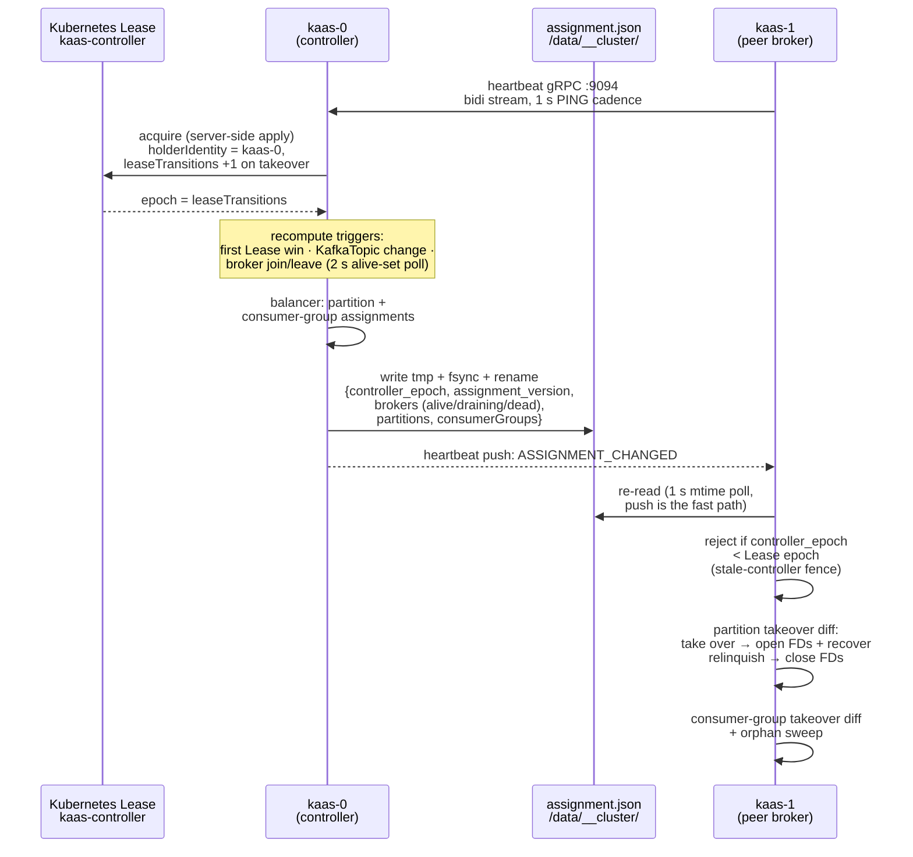

# Controller, leases & assignment.json

Controller election via a Kubernetes Lease, and `assignment.json` on the
shared volume as the single source of truth for partition leadership.

In Apache Kafka, the controller is elected by the metadata quorum —
KRaft today, ZooKeeper before it — and partition leadership reaches the
brokers through a replicated metadata log. kaas replaces that entire
machine with two much smaller parts (the first of the [three
substitutions](./overview.md)): election is a Kubernetes **Lease**, and
propagation is a **JSON file on the shared volume**.

The "controller" is just a broker holding the `kaas-controller` Lease —
there is no separate process and no Raft quorum. The Lease's
`leaseTransitions` counter is the cluster's epoch source: it increments
exactly when the holder changes, and a releasing controller re-sends it
so the epoch fence never rewinds.

A `KafkaClusterAssignments` CR exists as the intended `kubectl`-visible
debug mirror of this file, but the status writer is not wired up yet —
the CR's status is empty today, and the file on the volume is the only
place to read the assignment. There is no per-partition Lease: the
singleton controller Lease is the only Kubernetes coordination
primitive, and everything downstream of it travels through
`assignment.json` on the shared volume.

## What the controller does

The Lease holder takes on four extra responsibilities:

- **Observes peer brokers** via the heartbeat gRPC stream every broker
  dials into it. A broker that stops heartbeating ages out of the alive
  set, and a broker shutting down cleanly announces itself first: the
  drain flag set at SIGTERM rides its next heartbeat, so the controller
  moves its partitions while it is still healthy enough to hand them
  over, rather than waiting for a timeout.
- **Computes assignments** — partition leadership over the alive set,
  and consumer-group placement over the **full registered broker set**
  (alive, draining, and dead rows alike): the group-coordinator hash
  divides by that set, so dead rows are retained deliberately — see
  [Broker fencing](./broker-fencing.md).
- **Writes `assignment.json`**, epoch-prefixed, tmp + fsync + rename.
  Every broker rejects an assignment whose epoch is stale, so a deposed
  controller coming back from a GC pause can't roll the cluster
  backwards. Since the fencing work the file also carries every
  registered broker's health tri-state (alive / draining / dead), which
  is what DescribeCluster v2 reports as fenced brokers.

## When it recomputes

| Trigger | How the controller notices |
|---|---|
| First win of the controller Lease | initial recompute |
| `KafkaTopic` CR added / modified / deleted | the topic watch's change notification |
| Broker joins or leaves the alive set | the broker-set watcher's 2 s alive-set poll |

The alive set the balancer feeds on is the set of heartbeat-connected
brokers that report themselves healthy **and not draining** — a
broker's own 1 s liveness tick, trusted unconditionally, minus anyone
who has announced shutdown. The one exception is self-preservation:
the controller always pins itself into the set, so a cluster can never
compute an empty assignment out from under itself. Kubernetes endpoint readiness is only
the bootstrap fallback for a freshly elected controller that no broker
has dialed into yet, so a controller elected mid-rollout doesn't
compute an empty assignment. How a broker earns — and loses — its
place in the alive set is the subject of [Honest readiness & rollout
pacing](./readiness-rollout.md).

## How partitions get placed

Apache Kafka decides placement once, when a topic is created, and the
answer lives in the metadata log forever. kaas has no such log: the
assignment is recomputed from scratch every time an input changes. That
buys self-healing — a partition on a departed broker is simply somewhere
else in the next file — but it means the balancer has to *choose* to be
stable, because nothing outside it remembers the last answer.

It does that by deciding as little as possible:

1. **Keep** every partition whose current leader is still alive.
2. **Place** only what's left, giving each new partition to the broker
   holding the fewest partitions *of that topic*.
3. **Even out** the brokers, cluster-wide, until no broker leads more
   than one partition more than any other.
4. **Even out** each topic across brokers, by trading partitions
   between brokers rather than moving them one way — so the balance
   from step 3 survives untouched.

Step 1 comes first for a reason. Deriving the whole layout and *then*
noticing what didn't change gets the same answer in a steady state, but
it makes every recompute a fresh opinion about every partition — so
creating one topic could hand a dozen unrelated partitions to different
brokers. Each of those is a genuine cost here: the new leader opens the
log, replays the tail, and the old leader keeps acknowledging writes
until it notices it's been replaced.

Step 4 is separate from step 3 because an even cluster and an even
topic are different properties. Three brokers each leading 25
partitions look perfectly balanced, and a 3-partition topic can still
have all three of its partitions on one of them — every producer and
consumer for that topic talking to one broker while the other two sit
idle. Apache gets this for free by assigning each topic round-robin
from its own starting offset; kaas has to ask for it explicitly.

Two rules keep the moves cheap. Partitions that were just placed move
before partitions inherited from the previous assignment, since the
first cost nothing and the second cost a takeover. And the per-topic
pass swaps rather than moves — one partition each way between two
brokers — so it can never disturb the cluster-wide balance it runs
after.

## How peers follow

Non-controller brokers watch `assignment.json` via file notification
plus a 1 s poll; the heartbeat stream's `ASSIGNMENT_CHANGED` push is
the fast path, the poll the backstop. On every accepted assignment the
broker diffs the new leadership map against what it currently serves,
opening or relinquishing partitions in the storage engine to match (see
[File-handle ownership](./file-handles.md)), and does the same for
consumer groups (see [Consumer-group
coordination](./consumer-groups.md)).

Everything that needs a leadership answer — the Metadata response, the
Produce/Fetch ownership check, `/healthz`'s `partitions_led` — sources
from the broker's view of `assignment.json`. There is no second
authority to disagree with.

## Local-dev mode

When the broker starts outside a pod (the `MY_POD_NAME` env unset), the
cluster runtime isn't started at all: storage flips to in-memory and a
local shim answers "yes, I lead" for every partition. This is a
dev-loop convenience, not a single-node production mode — nothing is
persisted.

## Implementation notes (for contributors)

- Controller-side logic lives in `crates/kaas-controller`:
  `heartbeat_server.rs` (serves `proto/heartbeat.proto`),
  `balancer.rs` (assignment computation), `assignment_writer.rs`
  (epoch-prefixed write), `k8s_mirror.rs` (the CR mirror).
- Recompute wiring — the topic-watch callback (gh #74) and the 2 s
  broker-set watcher (gh #77) — is in `bins/kaas/src/cluster.rs`.
- The broker-side assignment watcher and stale-epoch rejection live in
  `crates/kaas-broker/src/coordinator.rs`; making `assignment.json`
  the single leadership authority was the gh #75 cleanup. The
  deposed-controller race is pinned down by
  `crates/kaas-controller/tests/stale_controller_race.rs`.
- Dev-mode selection is in `bins/kaas/src/main.rs`; the always-leader
  shim is `crates/kaas-broker/src/local_lease.rs`.
