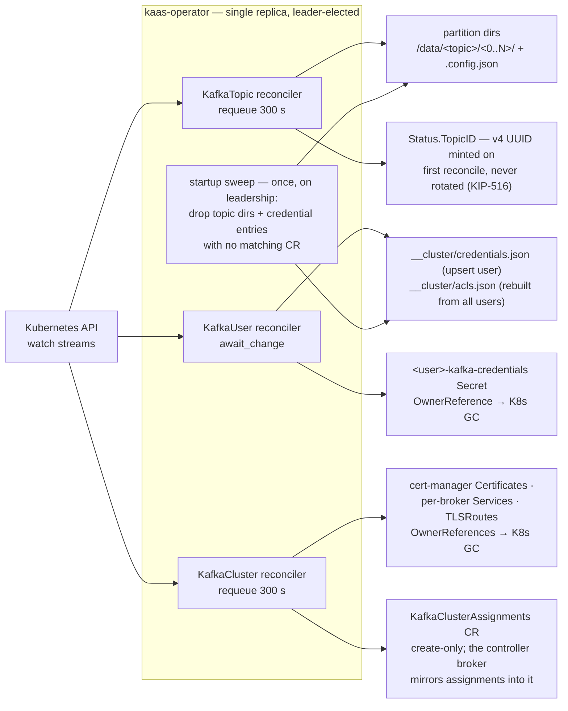

# Kubernetes integration

The four CRDs, their reconcilers, reconcile-time cleanup (no
finalizers), and the broker's RBAC surface.

In Apache Kafka, cluster metadata — topics, users, ACLs, quotas — lives
in the cluster's own replicated metadata log, and you manage it through
the Admin API or the shell tools. kaas keeps that admin surface but
moves the durable home of the metadata into Kubernetes **custom
resources** — the CR half of the Lease-and-CRs substitution for the
KRaft quorum (see the [overview](./overview.md)). If you have run Kafka
under Strimzi, the shape is deliberately familiar: `KafkaTopic` and
`KafkaUser` CRs reconciled by a single-replica operator. The difference
is what reconciliation produces — not configuration pushed into running
brokers, but **files on the shared volume** that brokers read directly.

## The CRD surface

Four CRDs — `KafkaCluster`, `KafkaTopic`, `KafkaUser`, and the
read-only `KafkaClusterAssignments` debug mirror; the
[overview](./overview.md) table shows what each materializes into. The
CRD YAML ships bundled with the Helm chart. `KafkaUser` mirrors Strimzi
1:1 for `spec.authentication` / `spec.authorization`, with two
deliberate divergences:

- **Quota field naming**: `spec.quotas` uses
  `producerMaxByteRatePerBroker` / `consumerMaxByteRatePerBroker` where
  Strimzi says `producerByteRate` / `consumerByteRate`. The semantics
  are identical to Strimzi/Apache (KIP-13: quotas are per-broker; N
  brokers → N× cluster ceiling) — the kaas names just say so honestly
  at the CR level.
- **No group abstraction**: there are no separate ACL or user-group
  CRs. ACLs are authored inline on each KafkaUser's
  `spec.authorization.acls`; granting the same rule to N principals
  means repeating it on N CRs — the standard Strimzi-pattern trade.

### TopicID (KIP-516) — where it stands

The `KafkaTopic` reconciler mints a v4 UUID into `Status.TopicID` on
first reconcile and never rotates it, so a re-created topic gets a
distinct ID — Apache's contract. Honesty note about the other half: the
broker-side plumbing that would carry that UUID to the wire exists but
**is not wired into the production topic watch** — every topic-registry
entry currently carries the all-zero sentinel, so Metadata v10+ serves
nil topic IDs for all topics. Clients treat that as "broker doesn't
expose topic IDs" and fall back to names. See the [KIP
index](../compat/kip-index.md) for the tracked gap.

## Operator reconcile loops

One reconciler per CRD. None of them use cleanup finalizers — deleting
a CR never blocks on the operator being alive; owned Kubernetes
resources carry `OwnerReferences` so garbage collection is
Kubernetes-native, and on-disk leftovers are reclaimed by a
leader-elected sweep at operator startup.

Reconciler guard rails worth knowing:

- **KafkaTopic** refuses partition decrease (`Ready=False`, no
  filesystem mutation) — partitions only grow, matching Kafka
  semantics.
- **KafkaUser** with a missing referenced Secret parks on
  `await_change` instead of hot-looping.
- **KafkaClusterAssignments** has no reconciler at all: the operator
  only creates it (with an OwnerReference); its status is written
  fire-and-forget by the controller broker, and brokers never read it
  back.
- A CR with `deletionTimestamp` set is left untouched by the
  reconcilers; cleanup happens via K8s GC (owned resources) and the
  startup sweep (on-disk state).

## What brokers do with the CRDs

On the broker side, the CRD surface is read-mostly — but not read-only:
the Kafka admin APIs `CreatePartitions` and `IncrementalAlterConfigs`
are served by patching the `KafkaTopic` CR (`spec.partitions` /
`spec.config`), and `CreateTopics` mints a fresh one. The operator then
materializes the change as usual. That is why broker RBAC carries
`update,patch` on `kafkatopics` in addition to the read verbs. Why
admin writes route through CRs at all is covered in
[Broker/operator runtime independence](./runtime-independence.md).

### ArgoCD and runtime-created topics

A topic created over the Kafka protocol exists as a `KafkaTopic` CR
that no GitOps tool put there: it has no tracking metadata and no
owner references, so in an ArgoCD-managed cluster it is invisible in
the Application tree — and hand-adding ArgoCD's tracking label would
be worse, because a tracked resource absent from git is exactly what
sync-with-prune deletes.

Setting `admin.argocd.enabled: true` on the Helm chart opts
broker-minted CRs into ArgoCD coexistence. Each one is created with:

- `argocd.argoproj.io/tracking-id` naming the Application (defaults
  to the Helm release name), so the topic renders in the Application
  tree alongside the git-managed resources;
- `argocd.argoproj.io/compare-options: IgnoreExtraneous`, so ArgoCD
  does not diff it against git — no drift, no selfHeal prune;
- `argocd.argoproj.io/sync-options: Delete=false`, so runtime-created
  topics survive an Application delete.

The last two are chart values (`admin.argocd.compareOptions` /
`syncOptions`); setting either to `""` skips that annotation — e.g. an
empty `compareOptions` deliberately surfaces "this topic is not in
git" as drift in the ArgoCD UI. Off by default: non-ArgoCD installs
get plain CRs.

This applies only to CRs the broker **creates** — today, topics.
`KafkaUser` CRs are never created at runtime: the ACL admin APIs edit
the `spec.authorization.acls` of a user that must already exist, and
stamping ArgoCD metadata onto a git-managed resource would *cause* the
drift the annotations exist to avoid. Runtime ACL edits to git-managed
users therefore still show as drift until the next sync — the
intentional trade described in the ACL API notes.

## Why there are no finalizers

Earlier versions used `kaas.rs/*-cleanup` finalizers that drained on CR
delete. ArgoCD's parallel cascade-delete then deadlocked a teardown:
the operator pod was deleted before its CRs, and every CR hung forever
waiting for a finalizer that nothing would ever clear. The replacement
design:

- **Owned external resources** (Certificates, Services, TLSRoutes,
  Secrets) carry `OwnerReferences` — Kubernetes GC handles them with no
  operator involvement.
- **On-disk state** (topic dirs, credential entries) is reclaimed by
  the leader-elected **startup sweep**, which drops anything on the
  volume with no matching CR.

Deleting the operator, the CRs, or both in any order can no longer
wedge — the cost is that on-disk cleanup happens at the *next operator
start* rather than synchronously with the delete.

## Readiness gate

Broker pods declare the `kaas.rs/PartitionsReady` readiness gate; the
broker patches its own pod condition once the partition directories it
needs exist on the volume — keeping a broker out of Service endpoints
until the storage it serves from is actually in place.

That gate is the *storage-provisioned* precondition. The full readiness
answer — `/readyz` returning 200 only once the broker is actually
serving its assigned partitions, and the controller's alive set
tracking main-runtime liveness rather than pod readiness — is its own
topic: see [Honest readiness & rollout
pacing](./readiness-rollout.md).

## Implementation notes (for contributors)

- CRD types are kube-derive structs in `crates/kaas-operator-api/src/`;
  `cargo xtask gen-crds` regenerates the YAML into `deploy/crds/` and
  the chart copy — CI fails on drift.
- Reconcilers and the startup sweep live in
  `crates/kaas-operator-controllers/`.
- The Strimzi-shape `KafkaUser` auth/authz surface landed in gh #135,
  which also removed the earlier `KafkaACL` / `KafkaUserGroup` CRs.
- Broker RBAC is `deploy/helm/kaas/templates/broker-rbac.yaml` — check
  it whenever a new admin write path lands.
- The readiness-gate patcher is `crates/kaas-k8s/src/readiness.rs`.
