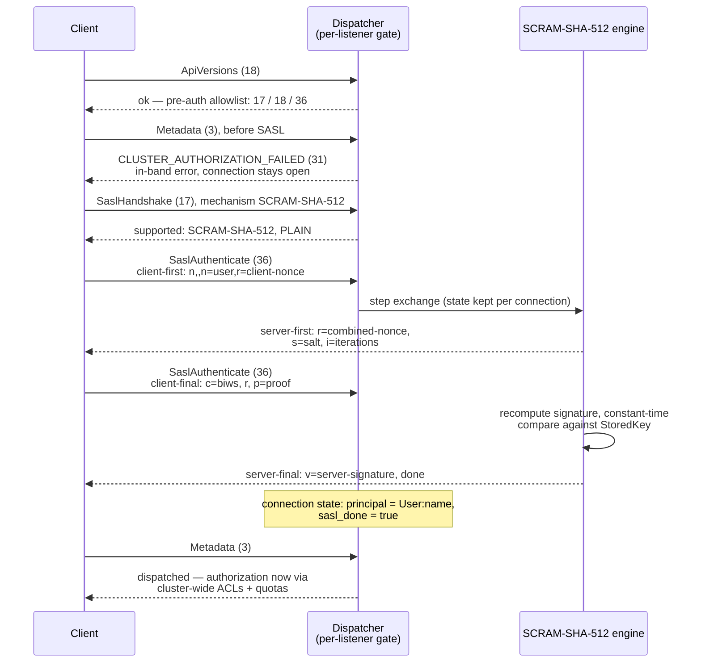

# Listeners, authentication, authorization

Strimzi-shaped listeners, per-listener authentication engines, and cluster-wide ACL and quota enforcement.

If you have configured Apache Kafka, you know the listener trinity —
`listeners`, `advertised.listeners`, `listener.security.protocol.map` —
with a cluster-wide authorizer and KIP-13 quotas layered on top. If you
have run Strimzi, you know its friendlier shape: an array of listeners,
each declaring its own port, type, TLS, and authentication. kaas adopts
the Strimzi shape 1:1 and keeps Apache Kafka's split intact:
**authentication is per-listener; authorization and quotas are
cluster-wide.**

Where the security metadata lives is the kaas difference. Apache Kafka
stores SCRAM credentials and ACLs in the metadata quorum, managed with
`kafka-configs.sh` / `kafka-acls.sh`; kaas manages users as Kubernetes
custom resources (`KafkaUser`, mirroring Strimzi's), which the operator
materializes into JSON files on the shared volume — part of the
CRs-as-metadata substitution from the
[introduction](../introduction.md). Brokers hot-reload those files: no
broker restart on user or ACL changes, and no Kubernetes API call on
the request path.

## Three orthogonal listener axes

Listeners are declared in the Helm chart (`.Values.listeners[]`); each
entry combines three independent axes:

- **`type`**: `internal` (in-cluster only) vs `external` (Gateway +
  cert-manager + per-broker hostnames).
- **`tls`**: `false` / `true`. `mtls` authentication implies
  `tls: true`; everything else is independent.
- **`authentication.type`**: `none` / `scram-sha-512` / `mtls` /
  `plain` / `oauth`. Each listener gets its own auth engine, selected
  by listener *name* — a free-form string the chart picks.

Running one listener per combination is normal — e.g. keep `plain`
anonymous for in-cluster bench/UI traffic and add an `authed` SCRAM
listener side by side, both governed by the same cluster-wide ACLs:

```yaml
listeners:
  - name: plain            # anonymous, in-cluster
    port: 9092
    type: internal
    tls: false
    authentication:
      type: none
  - name: authed           # SASL required, same ACL policy
    port: 9095
    type: internal
    tls: false
    authentication:
      type: scram-sha-512
```

### Per-listener Metadata advertisement

Each broker endpoint carries a per-listener port map, and the Metadata
handler answers with the port matching *the listener the request
arrived on*: a client that bootstrapped on `:9095` gets `:9095` back,
not `:9092`. Without this, an authed-listener client was handed the
anonymous listener's port in the Metadata response and looped on SCRAM
retry against a listener that never asks for SASL.

## The pre-auth gate on an authed listener

Anonymous listeners use an allow-all engine (no SASL, no principal); on
authenticated listeners the dispatcher blocks every API except the
pre-auth allowlist — SaslHandshake (17), ApiVersions (18),
SaslAuthenticate (36) — until the SASL exchange completes:



An mTLS listener satisfies the same gate at the TLS handshake instead:
the server extracts the principal from the client certificate (through
the KIP-371 principal-mapping rules below) and marks the connection
authenticated before any Kafka API arrives.

Anonymous listeners are not necessarily allow-all forever: setting the
chart's `auth.requireSasl` (the `KAAS_REQUIRE_SASL` env) hands
listeners declared `authentication.type: none` the real SASL engine
too, arming the pre-auth gate cluster-wide — every listener then
demands a completed SASL exchange before dispatching. Only
`KAAS_AUTH_DISABLED=true` outranks it.

## OAuth listeners (SASL/OAUTHBEARER)

If you have pointed a Strimzi listener at an OIDC provider —
`oauth.valid.issuer.uri`, `oauth.jwks.endpoint.uri` — the kaas shape
will look familiar. An `oauth` listener authenticates clients with the
OAUTHBEARER mechanism (KIP-255): the client obtains an OAuth 2 access
token (a JWT) from an external issuer — EntraID, Keycloak, Dex — and
presents it during the SASL exchange. The broker validates the token
**locally**: signature against the issuer's published JWKS, `exp`/`nbf`
with 60 s clock-skew allowance, exact `iss` match, and optionally
`aud`. No introspection round-trip per connection, no client secret on
the broker.

```yaml
listeners:
  - name: oauth
    port: 9096
    type: internal
    tls: true                # required in practice — see below
    authentication:
      type: oauth
      validIssuerUri: "https://login.microsoftonline.com/<tenant>/v2.0"
      jwksEndpointUri: "https://login.microsoftonline.com/<tenant>/discovery/v2.0/keys"
      userNameClaim: sub
      maxSecondsWithoutReauthentication: 3600
```

The Kafka principal is `User:<claim>` with the claim configurable
(`userNameClaim`, default `sub`; a `fallbackUserNameClaim` is tried
when the primary is absent) — for an EntraID service principal, `sub`
is the SP object id, so ACLs written for that GUID match the same
identity Strimzi sees. The signing keys are re-fetched every
`jwksRefreshSeconds` (default 300), with an early re-fetch when a
token names an unknown key id — an issuer rotating its keys costs one
rejected connection attempt, not five minutes of failures. Until the
first successful JWKS fetch every token is rejected: an unreachable
issuer means clients cannot authenticate, never that validation is
skipped.

Four deliberate hard edges:

- **OAUTHBEARER requires TLS.** A bearer token on the wire is a
  reusable credential — anyone who reads it can be you until it
  expires. kaas refuses the mechanism on plaintext connections, same
  as it refuses SASL PLAIN (SCRAM, which sends proofs rather than
  secrets, stays allowed on plaintext).
- **The `alg` header is an allowlist** (`RS256`/`RS384`/`RS512`/
  `ES256`), never trusted from the token: `none` and the HMAC family
  are rejected outright, which closes the classic algorithm-confusion
  attack where an HS256 token is "signed" with the public JWKS bytes.
- **Re-authentication is bounded (KIP-368).** With
  `maxSecondsWithoutReauthentication` set, a successful authentication
  advertises `session_lifetime_ms = min(configured, token remaining
  lifetime)` and the broker refuses further requests past the deadline
  until the client re-authenticates on the same connection — a
  connection cannot outlive its token by more than the configured
  bound. Re-authentication may not change the principal. Unset, the
  session is unbounded — the same default as Apache Kafka's
  `connections.max.reauth.ms=0`.
- **A rejected token fails in two steps**, per RFC 7628: the broker
  answers with a JSON `{"status":"invalid_token"}` challenge, the
  client acknowledges, and only then does the exchange fail with
  `SASL_AUTHENTICATION_FAILED` (58). The JSON body is deliberately
  content-free; the reason (expired, wrong issuer, unknown key) goes
  to the broker log.

Once a principal is on the connection, Produce/Fetch and the admin
surfaces consult the single cluster-wide authorizer and quota checker —
which is what lets an anonymous `plain` listener and an authed SCRAM
listener share one ACL/quota policy.

## Authorization

The cluster-wide authorizer is wired by `KAAS_AUTHORIZATION_TYPE`:
empty (default) means allow-all; `simple` enables ACL evaluation
against `/data/__cluster/acls.json`. `KAAS_SUPER_USERS`
(comma-separated `User:foo,User:bar`) wraps whichever authorizer was
picked in a super-user early-allow layer.

ACLs and credentials are **operator-materialized**: `KafkaUser` CRs
become entries in `credentials.json` + `acls.json`, which brokers
hot-reload. SCRAM credentials can also be rotated over the wire with
Kafka's SCRAM admin API (KIP-554, `kafka-configs.sh --alter
--add-config SCRAM-SHA-512=…`): describe answers from the hot-reloaded
credential store, and alter patches the `KafkaUser` CR — the CR stays
the source of truth, and the operator materializes the new credential
as usual (see the [ACL & quota admin
APIs](../compat/api/acls-quotas.md)). `KAAS_AUTH_DISABLED=true`
switches the whole subsystem off for dev setups.

**Authorization-only users (OAuth principals).** A `KafkaUser`'s
`spec.authentication` is optional (gh #42). An OAUTHBEARER principal
authenticates against the issuer, not against a stored credential, so
there is nothing for the operator to materialize — its `KafkaUser`
omits `authentication` entirely and carries only `authorization` (and
optional `quotas`), naming the principal through `metadata.name` (the
token's `sub` claim). The reconciler writes no `credentials.json`
entry for it and only contributes its rules to `acls.json`. This
mirrors Strimzi, whose OAuth users are authorization-only too, and is
what lets you author ACLs and quotas for a token-authenticated
identity.

### mTLS principal mapping (KIP-371)

kaas parses Apache's `ssl.principal.mapping.rules` syntax — regex over
the full subject DN with `$1`/`$2` back-references and `/L`/`/U` case
postfixes; first matching rule wins, `DEFAULT` returns the CN. The
server applies the mapper to the client certificate's subject DN during
the TLS handshake. Parse errors fail at startup, so a chart-config typo
is a crash-loop with a clear message, not every certificate silently
mapping to its CN.

## Quotas

The quota checker defaults to no-op and switches to real token buckets
when auth is enabled. Two properties matter:

- **Quotas are orthogonal to authorization** — they fire even with
  authorization off, and per KIP-13 they are **per-broker**: with N
  brokers the effective cluster ceiling is N × the configured rate (the
  CRD field names say so explicitly — see
  [Kubernetes integration](./kubernetes.md)).
- **Debt-carry**: the token bucket carries negative balances forward as
  debt rather than clamping at zero. With clamping, N concurrent
  clients each saw a "full" bucket and burst at N× the configured rate
  before throttling engaged — the observed 16-vs-10 MiB/s gap under
  bench load. Removing the clamp matches Apache's behaviour.

Throttle decisions surface as `throttle_time_ms` in responses. kaas
computes and returns it but does not yet mute the connection channel
afterwards (KIP-219's enforcement half) — cooperative clients throttle
themselves; adversarial ones are a known gap tracked in the
[KIP index](../compat/kip-index.md).

## Implementation notes (for contributors)

- Listener array → `KAAS_LISTENERS` JSON env: gh #126. The connection's
  listener name is carried by
  `crates/kaas-protocol/src/connstate.rs` (free-form string, no
  predefined constants — the chart picks the names).
- Per-listener auth engines live in `crates/kaas-auth`, selected per
  listener name; the pre-auth gate is enforced in the protocol
  dispatcher (gh #124).
- Per-listener Metadata port advertisement and quota debt-carry:
  gh #125. Debt-carry is pinned by the
  `multi_client_contention_carries_debt` unit test next to the token
  bucket (`crates/kaas-auth/src/quota.rs`).
- ACL evaluation: `crates/kaas-auth/src/acls.rs`.
- Principal mapping: `crates/kaas-auth/src/principal_mapping.rs`
  (gh #43).
- OAUTHBEARER + JWT/JWKS validation: `crates/kaas-auth/src/oauth.rs`
  (gh #42). The validator is pure-sync (SASL hot path); the JWKS HTTP
  fetch loop lives in `bins/kaas/src/main.rs`
  (`spawn_jwks_refreshers`), mirroring the credentials/ACL hot-reload
  split. Config field names mirror Strimzi's
  `KafkaListenerAuthenticationOAuth` 1:1 and travel chart →
  `KAAS_LISTENERS` → `crates/kaas-broker/src/cli.rs`. End-to-end
  smoke: `bins/kaas/tests/oauth_smoke.rs` (TLS listener + wiremock
  JWKS + ES256 tokens).
