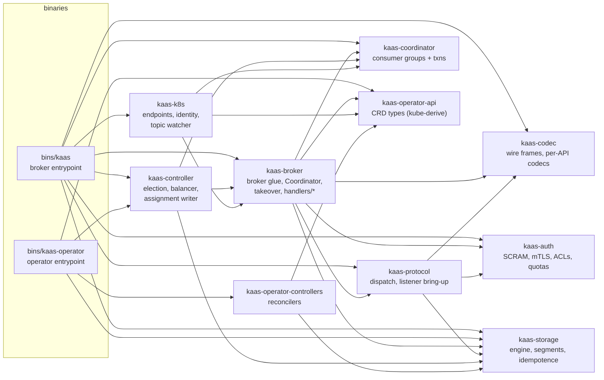

# Workspace layout & crate dependency graph

Twelve library crates, two binaries, and an xtask runner — who depends on whom, and why the layering looks the way it does.

The workspace root carries `Cargo.toml`, `rust-toolchain.toml` (pinned
toolchain, auto-installed by rustup), `proto/` (the heartbeat gRPC schema),
`deploy/` (Helm chart + generated CRDs), `scripts/` (the Apache shell-tool
parity suite), and `docs/` (this book). `protoc` is vendored via the
broker's build script — a fresh checkout needs nothing beyond rustup.

The layering rule that shapes the graph: **`kaas-codec` knows nothing about
storage, storage knows nothing about Kubernetes, and nothing below
`kaas-broker` knows about request handling.** Wire bytes stay byte-opaque
from codec through storage (the invariant Part II's
[wire-protocol chapter](../compat/wire-protocol.md) documents), and the
Kubernetes-facing crates (`kaas-k8s`, `kaas-operator-*`) sit off the hot
path entirely ([runtime
independence](../architecture/runtime-independence.md)).

Each crate has its own short chapter in this part — what it owns, the
invariants callers must hold, and where to start reading. If you've
arrived from Parts I–II you already know what the system does and what
it speaks on the wire; these chapters assume that and point back to the
architecture pages instead of re-explaining semantics. The chapter order
is a deliberate reading order, following the wire inward:
[kaas-codec](kaas-codec.md) → [kaas-protocol](kaas-protocol.md) →
[kaas-storage](kaas-storage.md) →
[kaas-coordinator](kaas-coordinator.md) → [kaas-broker](kaas-broker.md)
→ [kaas-controller](kaas-controller.md), then the supporting crates
([kaas-auth](kaas-auth.md), [kaas-k8s](kaas-k8s.md),
[kaas-observability](kaas-observability.md)), the operator pair
([kaas-operator-api](kaas-operator-api.md),
[kaas-operator-controllers](kaas-operator-controllers.md)),
[kaas-test-harness](kaas-test-harness.md), and finally the two binaries
that plug every seam together ([kaas](bin-kaas.md) and
[kaas-operator](bin-kaas-operator.md)).

## Crate dependency graph

An arrow reads "depends on". Verified against each crate's `Cargo.toml`
`[dependencies]` (runtime deps only, dev-dependencies excluded).

Two crates are left off the diagram to keep it readable:

- **`kaas-observability`** is depended on by every crate above except
  `kaas-codec` and `kaas-operator-api` (and by both bins); its own single
  dependency is `kaas-codec`, for the byte-opacity tripwire counters.
- **`kaas-test-harness`** depends on nothing in the workspace and nothing
  depends on it — it is still an empty placeholder crate.

> This graph is hand-maintained (checked against `Cargo.toml` on 2026-08-11).
> Auto-generating it from `cargo metadata` is a possible future
> `gen-api-matrix`-style xtask.
